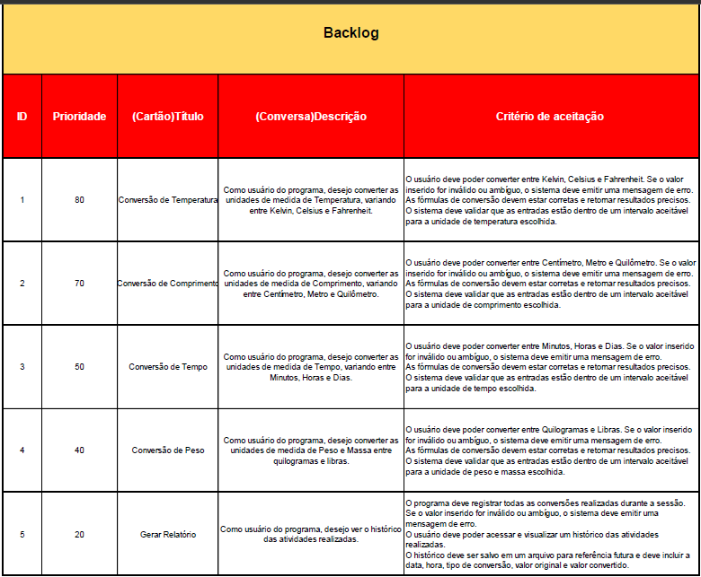
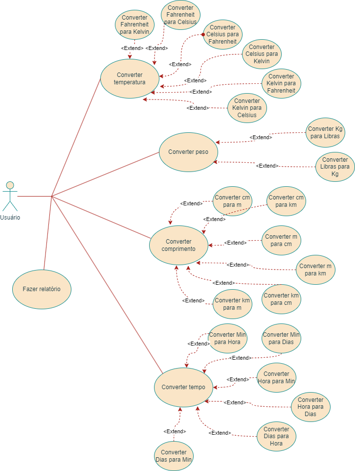
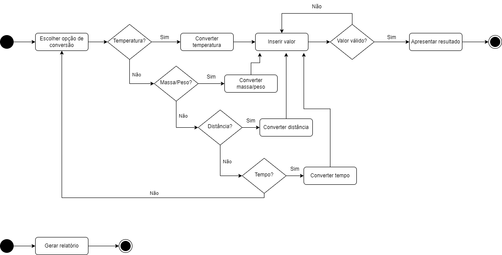

# ConverSir

#### _Conversor de Unidades_

***
#### Desenvolvido por:
- [Cleber Alexandre Souza Júnior](https://github.com/SouzaCleber98)
- [Letícia Cristina Leme](https://github.com/leticiaaleme)
- [Murilo Camillo Martins](https://github.com/MuriloCamillo)
***
## Introdução
Neste projeto, desenvolvemos um Conversor de Unidades que permite aos usuários converter diferentes tipos de unidades, como temperatura, distâncias, peso/massa e tempo, de forma fácil e eficiente. O objetivo principal é fornecer uma ferramenta versátil e amigável que atenda às necessidades de conversão de unidades de uma variedade de usuários.
### Visão do produto
Para pessoas que buscam praticidade e agilidade na hora de converter grandezas de diferentes bases, o ConverSir é uma aplicação de conversão de valores que oferece uma interface amigável e intuitiva. Visando evitar as complicações e o tempo gasto ao converter grandezas manualmente, nosso produto garante uma variedade de opções de conversões, feitas de forma rápida e prática, além de um emissor de relatórios das atividades realizadas.
***

## Product Backlog



***
## Diagramas da UML

### Diagrama de Caso de Uso



### Descrição dos Fluxos de Eventos

Fluxo Básico
1. Usuário seleciona a opção desejada.
2. Opção selecionada é “Converter Temperatura”.
3. Usuário digita os valores a serem convertidos.
4. Sistema apresenta o valor convertido.
   
Fluxo Alternativo

2. Opção selecionada é “Converter Massa/Peso” e retorna para o passo 3.

   2.a. Opção selecionada é “Converter Comprimento” e retorna para o passo 3.

      2.a.a. Opção selecionada é “Converter Tempo” e retorna para o passo 3.
    
3. Valor inválido: se o usuário inserir um valor inválido ou ambíguo, uma mensagem de erro é apresentada, solicitando para reinserir o valor.

### Diagrama de Atividades



***

## Problemas e Soluções
Durante o desenvolvimento do projeto, o principal problema encontrado foi o cenário de inserção de caracteres inválidos por parte do usuário, no campo de valores. Já apontado na fase inicial de desenvolvimento, uma preocupação seria o caso do usuário da aplicação, ao inserir os valores que deseja converter, o faz utilizando com letras e/ou caracteres especiais, causando problemas na coleta dos dados para que as conversões sejam feitas.
Para a solução do problema, a equipe buscou implementar validações de entrada para que apenas caracteres numerais sejam aceitos, com exceção da vírgula (,) para valores reais, e emitir uma mensagem amigável para alertar ao usuário do uso indevido/errôneo dos valores de entrada.
***

## Conclusão
Após o desenvolvimento deste projeto, concluímos que o Conversor de Unidades oferece uma solução eficaz para a conversão de uma variedade de unidades, desde temperatura até peso e tempo. Com uma interface amigável e intuitiva, o aplicativo atende às necessidades de diversos usuários, proporcionando uma experiência de conversão simples e eficiente. Este projeto demonstra nossa capacidade de criar ferramentas versáteis que agregam valor ao facilitar tarefas cotidianas e complexas, contribuindo para a praticidade e eficiência no dia a dia.
***

## Referências

- ### Guia de Usuário

Usuário ao acessar o sistema se depara com uma interface simples que lhe oferece quatro opções de conversões e a funcionalidade de gerar relatórios.


Caso o usuário selecione a opção Converter Temperatura, encontrará o campo de inserção do valor que deseja converter para as seguintes bases:
- Fahrenheit > Kelvin
- Fahrenheit > Celsius
- Kelvin > Fahrenheit
- Kelvin > Celsius
- Celsius > Fahrenheit
- Celsius > Kelvin


A opção Converter Massa permite ao usuário, após inserir o valor desejado, converter para as seguintes bases:
- Quilos > Libras
- Libras > Quilos


Se a necessidade do usuário for a de Converter Distâncias:
- Centímetro > Metros
- Centímetro > Quilômetro
- Metros > Centímetro
- Metros > Quilômetro
- Quilômetro > Centímetro
- Quilometro > Metro


Já Converter Tempo:
- Minutos > Hora
- Minutos > Dia
- Hora > Dia
- Hora > Minutos
- Dia > Minutos
- Dia > Hora


Por fim, o usuário poderá ver o histórico de suas conversões caso deseje, selecionando a opção de Gerar Relatório.


***

## Como utilizar

- Clone o repositório para o seu ambiente local:
```c
git clone https://github.com/leticiaaleme/projeto-conversir.git
```

- Abra o projeto na IDE de preferência;
  
- Execute o projeto para iniciar o ConverSir;

- Siga as instruções fornecidas na interface. 
